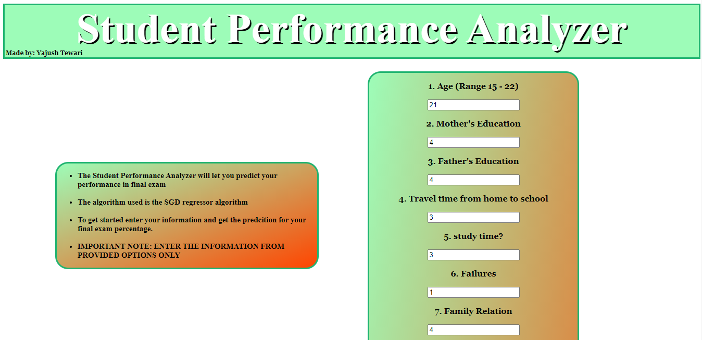
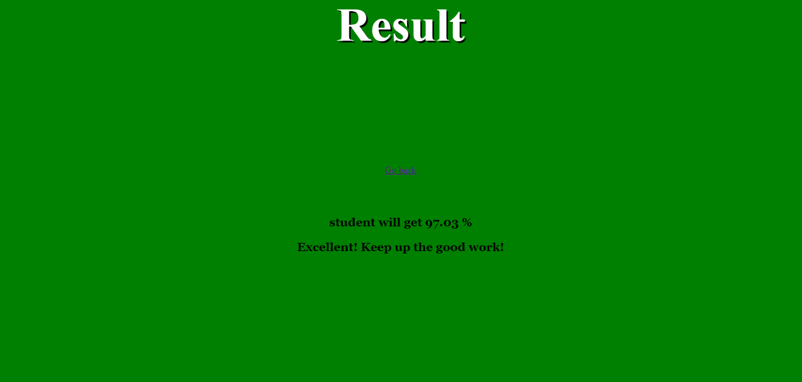
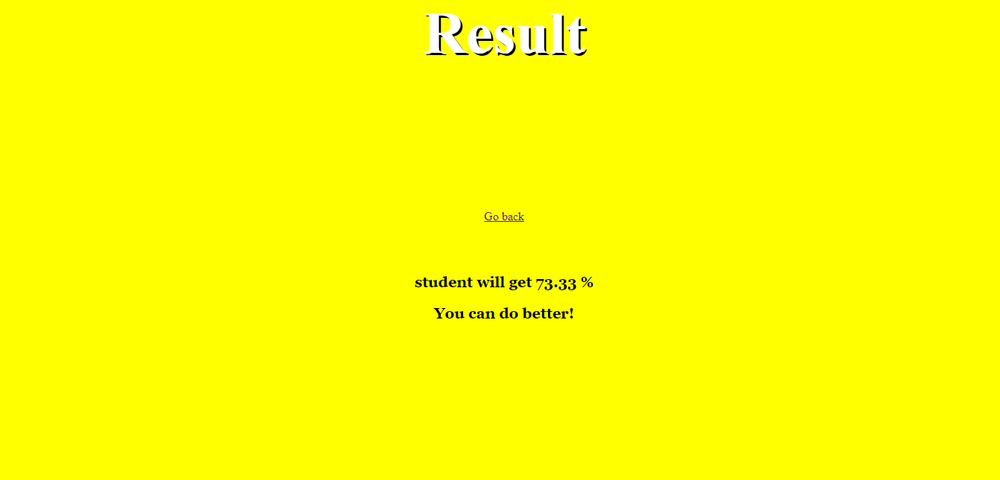
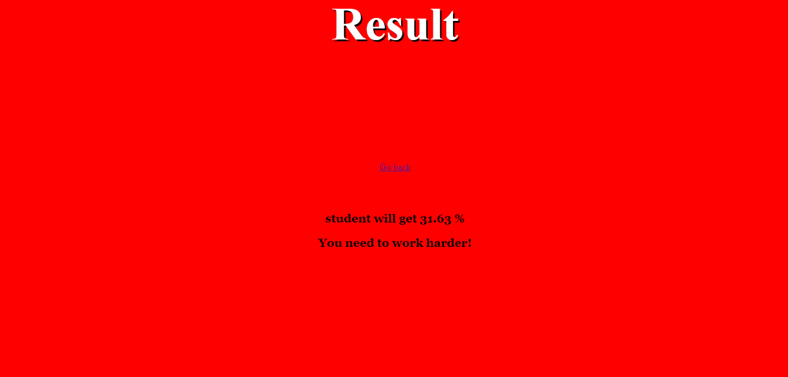

This is the front page of the program, fill all the required information and click submit

   
   
The ml model in backend will predict your performance for final exam:

It also changes background color according to your percentage, like green for good and yellow for average:

If you got really bad percentage it will change the background color to red:

